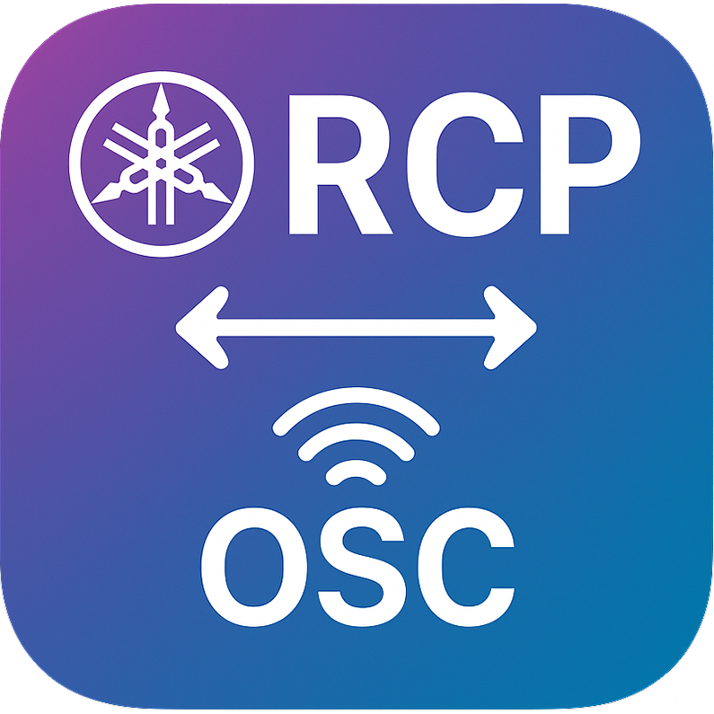
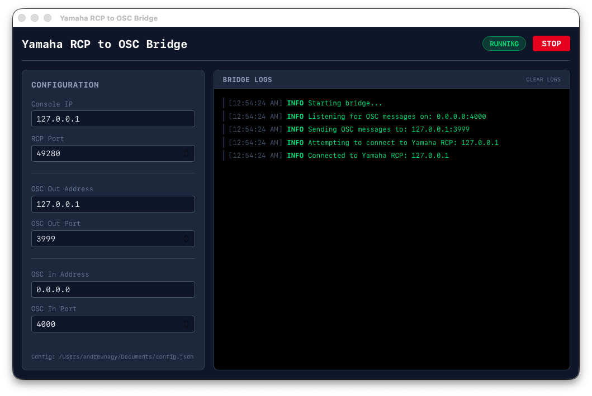

<div align="center">



# Yamaha RCP to OSC Bridge

A Rust-based bridge that translates Yamaha RCP (Remote Control Protocol) commands into OSC (Open Sound Control) messages, enabling integration between Yamaha mixing consoles and OSC-compatible systems.

[Overview](#overview) • [Getting started](#getting-started) • [Usage](#usage) • [GUI](#gui) • [Development](#development) • [References](#references)

</div>

## Overview

Yamaha does not provide a real-time interface to their consoles. The only way to get real-time data is through RCP, a proprietary and largely undocumented protocol. This project bridges RCP to OSC, making it possible to control and monitor Yamaha mixing consoles (DM3, DM7, QL, CL, and similar) from any OSC-compatible software or hardware.

```
┌─────────────────┐   RCP (TCP)   ┌────────────────────┐   OSC (UDP)   ┌─────────────────┐
│ Yamaha console  │ ◄───────────► │ yamaha-rcp-to-osc  │ ◄───────────► │ OSC application │
└─────────────────┘               └────────────────────┘               └─────────────────┘
```

Features:

- **Bidirectional bridging** — RCP notifications are converted to OSC messages, and incoming OSC messages are passed back to the console as RCP commands.
- **Scene detail workaround** — RCP's `sscurrent_ex` notification carries no detail, so the bridge automatically issues an `ssinfo_ex` query to fetch full current-scene information.
- **CLI and GUI** — run it headless from the command line, or use the Tauri-based desktop app.
- **Fast restarts** — sockets are configured with `SO_REUSEADDR`/`SO_REUSEPORT` so the bridge can be restarted immediately.

## Getting started

### Prerequisites

- [Rust](https://rustup.rs/) (stable) for the CLI
- [Node.js](https://nodejs.org/) 18+ and npm, only if you want the GUI

### Installation

Download a prebuilt CLI binary from the [releases page](../../releases), or build from source:

```bash
cargo build --release
# binary at target/release/yamaha-rcp-to-osc
```

## Usage

```bash
yamaha-rcp-to-osc --console-ip 192.168.69.165
```

### Options

| Flag | Description | Default |
|------|-------------|---------|
| `--console-ip` | Console IP address (required) | — |
| `--rcp-port` | Console RCP port | `49280` |
| `--udp-osc-out-addr` | Address to send OSC messages to | `127.0.0.1` |
| `--udp-osc-out-port` | Port to send OSC messages to | `3999` |
| `--udp-osc-in-addr` | Local address to listen for OSC on | `0.0.0.0` |
| `--udp-osc-in-port` | Local port to listen for OSC on | `4000` |

### Example: Vor

To display the current scene of a DM3 in [Vor](https://thelightingcontroller.com/):

1. Create a Custom OSC connection.
2. Set `Address 1` to `/ssinfo_ex/scene_a`.
3. Create a layout from Custom OSC with the label set to `Console: %1:2 %1:3`.

```bash
yamaha-rcp-to-osc --console-ip 192.168.69.165 --udp-osc-out-port 5003
```

## GUI

A Tauri v2 + React desktop app wraps the same bridge core with a configuration form, start/stop controls, and a live status indicator.



```bash
npm install
npm run tauri dev     # development with hot reload
npm run tauri build   # production build in src-tauri/target/release/bundle/
```

> [!NOTE]
> The GUI and the CLI share the same Rust library (`src/lib.rs`), so bridge behavior is identical in both.

## Development

A `Makefile` wraps the commands below — run `make help` to see all targets (`make dev`, `make build`, `make gui-build`, `make check`, etc.).

```bash
cargo run -- --console-ip 192.168.1.100   # run the CLI from source
cargo test                                # run the test suite
cargo clippy -- -D warnings               # lint
cargo fmt                                 # format
npm run lint                              # lint the GUI frontend
```

To test without a physical console, `npm run nc` starts a netcat listener on the RCP port (49280).

### Project layout

```
├── src/
│   ├── lib.rs            # Core bridge logic (shared by CLI and GUI)
│   ├── main.rs           # CLI entry point
│   ├── App.tsx           # GUI frontend (React)
│   └── main.tsx          # React entry point
├── src-tauri/            # Tauri backend (start/stop bridge commands)
├── tests/                # Integration tests (RCP <-> OSC conversion)
└── .github/workflows/    # CI: tests on Linux/macOS/Windows, tagged releases
```

## Roadmap

- [ ] TCP OSC support
- [ ] OSC 1.1 support ([rosc#62](https://github.com/klingtnet/rosc/pull/62))

## References

1. [Companion Module Implementation](https://github.com/bitfocus/companion-module-yamaha-rcp) — examples of RCP protocol usage
2. [QL Series SCP Commands Documentation](https://discourse.checkcheckonetwo.com/t/ql-series-scp-commands/2266/21) — protocol discussion
3. [Yamaha RCP Protocol Documentation](https://my.yamaha.com/files/download/other_assets/8/1623778/DME7_remote_control_protocol_spec_v100_en.pdf) — official DME7 RCP spec
4. [yamaha-rcp-docs](https://github.com/BrenekH/yamaha-rcp-docs) — community protocol documentation
